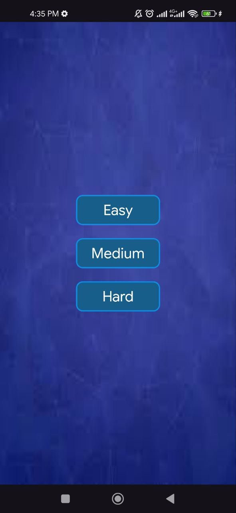
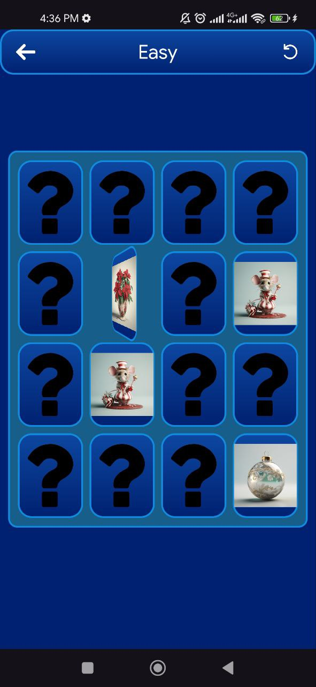
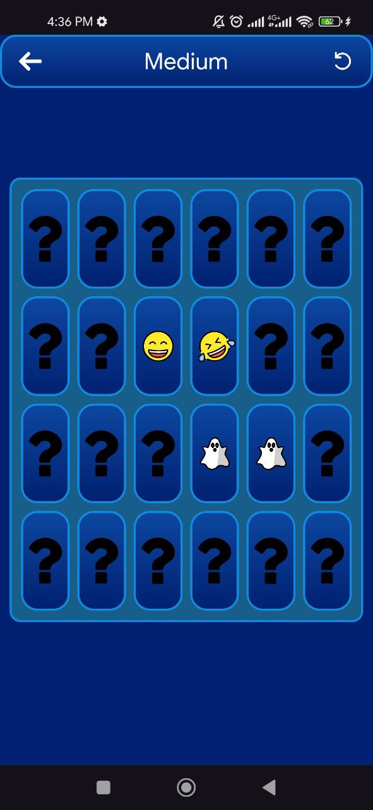

# Animations App

An Android application that demonstrates **core animation techniques in Android**. The project is intended for learning and practice, showcasing how different animations work and how they can be applied to UI components to improve user experience.

---

## Features

* View animations (scale, rotate, fade, translate)
* Property animations
* Smooth and responsive UI interactions
* Clean and simple demo-focused layout

---

## Screenshots

<div style="display: flex; gap: 12px; flex-wrap: wrap;">
  
  
  
</div>

---

## Tech Stack

* **Language:** Kotlin
* **Platform:** Android
* **UI:** XML
* **Animations:** View Animation / Property Animation

---

## Getting Started

1. Clone the repository

   ```bash
   git clone https://github.com/IslombekYoqubov/Animations_App.git
   ```
2. Open the project in **Android Studio**
3. Sync Gradle files
4. Run the app on an emulator or physical Android device

---

## Project Structure

```
Animations_App/
│
├── app/
│   ├── ui/
│   ├── animations/
│   └── MainActivity.kt
│
├── images/
├── README.md
└── build.gradle
```

---

## Contributing

Contributions are welcome. If you would like to improve or extend this project:

1. Fork the repository
2. Create a new branch (`feature/your-feature-name`)
3. Commit your changes
4. Push to your branch
5. Open a Pull Request

---

## License

This project is licensed under the MIT License.

---

## Author

**Islombek Yoqubov**
GitHub: [https://github.com/IslombekYoqubov](https://github.com/IslombekYoqubov)
